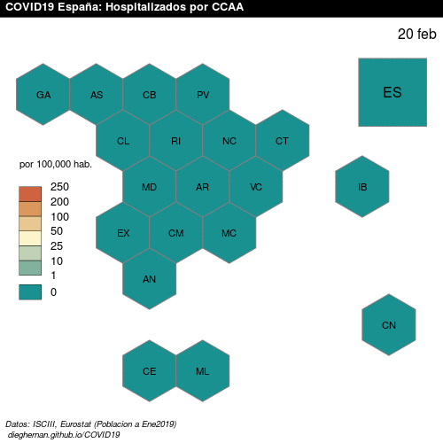
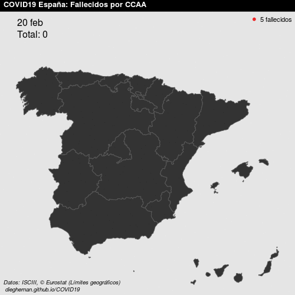

```{r setup, include=FALSE}
knitr::opts_chunk$set(message = FALSE,
                      warning = FALSE,
                      include = FALSE)
#Update source
rm(list = ls())
source("./RCode/collate_data.R")
load("CUSTOM/lastdate.Rdata")
stored <- "2020-01-01"
load("CUSTOM/COVIDEsp.RData")
last <- max(COVIDEsp$Fecha)
#Sys.setlocale("LC_TIME", "Spanish")
Sys.setlocale("LC_TIME", "es_ES.UTF-8")
f <- format(max(COVIDEsp$Fecha), "%d %B")
source("./RCode/func_ratiohosp.R", encoding = "UTF-8")
source("./RCode/func_fallecidos.R", encoding = "UTF-8")

allfechas <- unique(COVIDEsp$Fecha)

process <- allfechas[allfechas > stored]

for (i in 1:length(process)) {
  RatioHosp(process[i])
  Fallecidos(process[i])
  stored = process[i]
  save(stored, file = "./CUSTOM/lastdate.Rdata")
}

#Crea copia de actuales
fpng <- paste0("./pngs/Fallecidos_", format(last, "%y%m%d"), ".png")
file.copy(fpng, "FallecidosAct.png")
fpng <- paste0("./pngs/RatioHosp_", format(last, "%y%m%d"), ".png")
file.copy(fpng, "RatioHospAct.png")

```
*Datos publicados a `r f`*

## Últimos datos

### Hospitalizados por 100.000 habitantes 


### Fallecidos en España


```{r message=FALSE, warning=FALSE, include=FALSE}
#Gifs
rm(list = ls())
library(magick)
pngs <- list.files("pngs/")
all <- pngs[grep("Fallec", pngs)]
f <- image_read(paste0("pngs/", all))
gif <- image_animate(f, optimize = TRUE, fps = 1)
image_write(gif, "gifs/Fallecidos.gif")


all <- pngs[grep("RatioHosp", pngs)]
f <- image_read(paste0("pngs/", all))
gif <- image_animate(f, optimize = TRUE, fps = 1)
image_write(gif, "gifs/RatioHosp.gif")
```

## Evolución

### Evolución Hospitalizados por 100.000 habitantes 




### Evolución Fallecidos en España




##### Generado en `r format(Sys.time(), "%d %B %Y %H:%M:%S", usetz = TRUE)`
