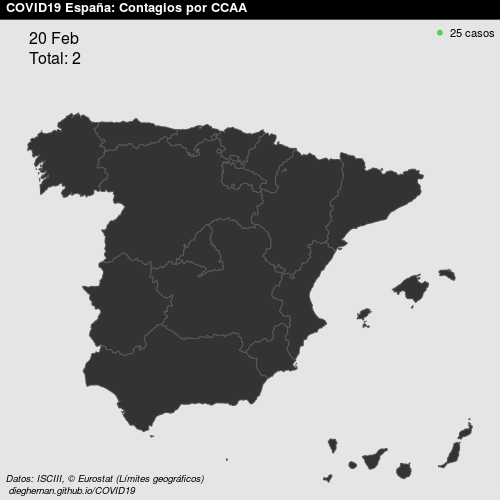

# COVID19 en España

En la web: https://dieghernan.github.io/COVID19/ 

## El proyecto
> **Proyecto obsoleto**: Debido a los cambios en el aprovisionamiento de la información, este proyecto se considera obsoleto y no recibirá mas
actualizaciones. 

Projecto Open Source de visualización geográfica de la evolución de la
pandemia COVID19 en España. Se proporcionan gráficos estáticos en
formato `png` (500x500 pixels) y visualizaciones de evolución en formato
`gif`. El histórico de `png` diarios se encuentran en [este
repositorio](https://github.com/dieghernan/COVID19/tree/master/assets/png).

**Fuente de datos**

-   Datos oficiales proporcionados por el [Instituto de Salud Carlos III
    (ISCIII)](https://covid19.isciii.es/).
-   © EuroGeographics para los límites administrativos.
-   Datos de población extraídos mediante el paquete
    [`eurostat`](http://ropengov.github.io/eurostat) (© Leo Lahti, Janne
    Huovari, Markus Kainu, Przemyslaw Biecek. Retrieval and analysis of
    Eurostat open data with the eurostat package. [R Journal
    9(1):385-392, 2017.](https://journal.r-project.org/archive/2017/RJ-2017-019/index.html))

**Licencia de uso**

Projecto generado bajo [**MIT License**](./LICENSE). Se permite la
reutilización siempre y cuando se cite a este repositorio como fuente.

**Buzón de sugerencias**

Este proyecto se plantea como un proyecto colaborativo. Para sugerencias
de nuevas visualizaciones, errores en los datos o cualquier otro asunto
relacionado con este proyecto, puedes ponerte en contacto con los
administradores a través de este enlace:
[Buzón](https://github.com/dieghernan/COVID19/issues/new/choose).

*Website creado con [Chulapa Jekyll Theme](https://dieghernan.github.io/chulapa/)*

