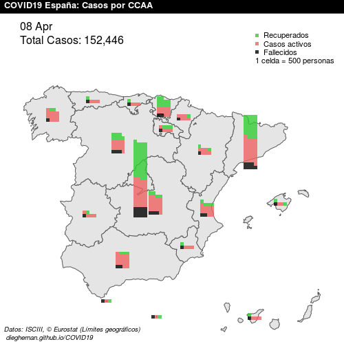
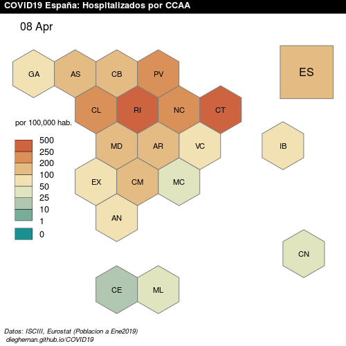
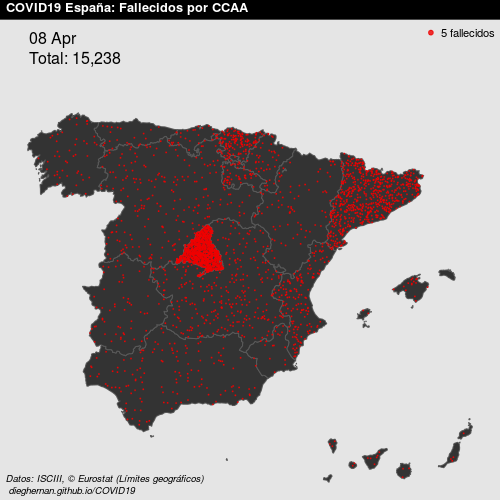
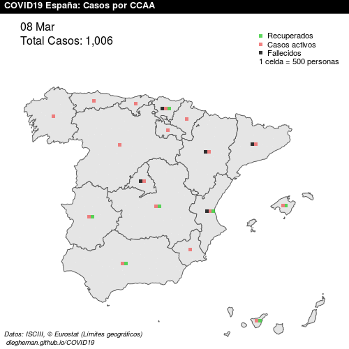
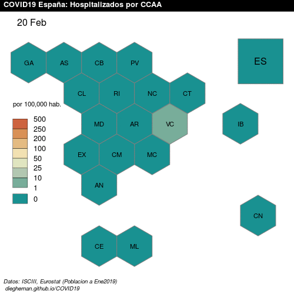
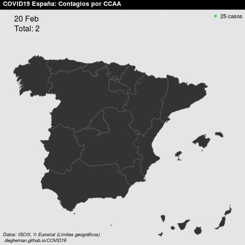
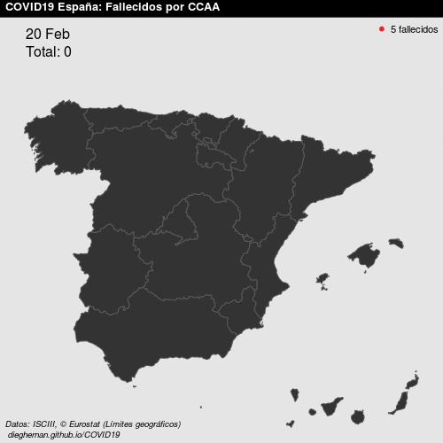

```{r setup, include=FALSE}
knitr::opts_chunk$set(message = FALSE,
                      warning = FALSE,
                      include = FALSE)
#Update source
rm(list = ls())
#source("./RCode/collate_data.R") Invalid - Data source change
load("assets/data/lastdate.Rdata")
load("assets/data/COVIDEsp.Rdata")
last <- max(COVIDEsp$Fecha)
#Sys.setlocale("LC_TIME", "Spanish")
#Sys.setlocale("LC_TIME", "es_ES.UTF-8")
f <- format(max(COVIDEsp$Fecha+1), "%d %B")
```

*Datos publicados a `r f`*

## El proyecto

Projecto Open Source de visualización geográfica de la evolución de la pandemia COVID19 en España. Se proporcionan gráficos estáticos en formato `png` (500x500 pixels) y visualizaciones de evolución en formato `gif`. La página se actualiza una vez al día y muestra los mapas más recientes, el histórico de `png` diarios se encuentran en [este repositorio](https://github.com/dieghernan/COVID19/tree/master/pngs).

- [Últimos datos](#últimos-datos)
- [Evolución](#evolución)

**Fuente de datos**

- Datos oficiales proporcionados por el [Instituto de Salud Carlos III (ISCIII)](https://covid19.isciii.es/).
- © EuroGeographics para los límites administrativos.
- Datos de población extraídos mediante el paquete [`eurostat`]( http://ropengov.github.io/eurostat) (© Leo Lahti, Janne Huovari, Markus Kainu, Przemyslaw Biecek. Retrieval and analysis of Eurostat open data with the eurostat package. [R Journal 9(1):385-392, 2017.](https://journal.r-project.org/archive/2017/RJ-2017-019/index.html))

**Licencia de uso**

Projecto generado bajo [**MIT License**](./LICENSE). Se permite la reutilización siempre y cuando se cite a este repositorio como fuente.

**Buzón de sugerencias**

Este proyecto se plantea como un proyecto colaborativo. Para sugerencias de nuevas visualizaciones, errores en los datos o cualquier otro asunto relacionado con este proyecto, puedes ponerte en contacto con los administradores a través de este enlace: [Buzón](https://github.com/dieghernan/COVID19/issues/new/choose).


## Últimos datos


```{r actualiza, message=FALSE, warning=FALSE, include=FALSE}
source("./R/func_ratiohosp.R", encoding = "UTF-8")
source("./R/func_fallecidos.R", encoding = "UTF-8")
source("./R/func_all.R", encoding = "UTF-8")
source("./R/func_contagios.R", encoding = "UTF-8")
source("./R/func_evocasos.R", encoding = "UTF-8")

 allfechas <- unique(COVIDEsp$Fecha)
#  for (j in 1:length(allfechas)){
#    RatioHosp(allfechas[j])
#  }
process <- allfechas[allfechas >= stored]


for (i in 1:length(process)) {
  RatioHosp(process[i])
  Fallecidos(process[i])
  AllCases(process[i])
  Contagios(process[i])
  Evocasos(process[i])
  stored = process[i]
  save(stored, file = "./assets/data/lastdate.Rdata")
}

#Crea copia de actuales
fpng <- paste0("./assets/png/Fallecidos/Fallecidos_", format(last, "%y%m%d"), ".png")
file.copy(fpng, "./assets/FallecidosAct.png", overwrite = TRUE )
fpng <- paste0("./assets/png/RatioHosp/RatioHosp_", format(last, "%y%m%d"), ".png")
file.copy(fpng, "./assets/RatioHospAct.png", overwrite = TRUE)
fpng <- paste0("./assets/png/Casos/Casos_", format(last, "%y%m%d"), ".png")
file.copy(fpng, "./assets/CasosAct.png", overwrite = TRUE)
png <- paste0("./assets/png/Contagios/Contagios_", format(last, "%y%m%d"), ".png")
file.copy(fpng, "assets/ContagiosAct.png", overwrite = TRUE)
fpng <- paste0("./assets/png/RatioNuevosCasos/RatioNuevosCasos_", format(last, "%y%m%d"), ".png")
file.copy(fpng, "./assets/RatioNuevosCasosAct.png", overwrite = TRUE)

```

##### Total Casos por situación en España



##### Hospitalizados por 100.000 habitantes



##### Contagios en España


##### Fallecidos en España



```{r Crea gifs, eval=FALSE, message=FALSE, warning=FALSE, include=FALSE}
#Gifs
rm(list = ls())
library(magick)
pngs <- list.files("assets/png/Fallecidos/")
f <- image_read(paste0("assets/png/Fallecidos/", pngs))
gif <- image_animate(f, optimize = TRUE, fps = 2, loop = 0)
image_write(gif, "assets/Fallecidos.gif")
 
 
pngs <- list.files("./assets/png/RatioHosp/")
f <- image_read(paste0("./assets/png/RatioHosp/", pngs))
gif <- image_animate(f, optimize = TRUE, fps = 2, loop = 0)
image_write(gif, "./assets/RatioHosp.gif")

pngs <- list.files("./assets/png/Casos/")
f <- image_read(paste0("./assets/png/Casos/", pngs))
gif <- image_animate(f, optimize = TRUE, fps = 2, loop = 0)
image_write(gif, "./assets/Casos.gif")

pngs <- list.files("./assets/png/Contagios/")
f <- image_read(paste0("./assets/png/Contagios/", pngs))
gif <- image_animate(f, optimize = TRUE, fps = 2, loop = 0)
image_write(gif, "./assets/Contagios.gif")

pngs <- list.files("./assets/png/RatioNuevosCasos/")
f <- image_read(paste0("./assets/png/RatioNuevosCasos/", pngs))
gif <- image_animate(f, optimize = TRUE, fps = 2, loop = 0)
image_write(gif, "./assets/RatioNuevosCasos.gif")
```


## Evolución

##### Evolución Casos en España




##### Evolución Hospitalizados por 100.000 habitantes



##### Evolución Contagios en España



##### Evolución Fallecidos en España



---

*Generado `r format(Sys.time(), "%d %B %Y %H:%M:%S", usetz = TRUE, tz="CET")` con* **R-Studio**.

